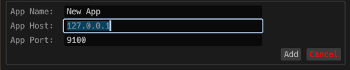
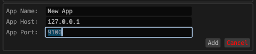

# VOR

*A router application for VRChat OSC, which allows OSC packets to be routed to multiple OSC applications.*

Questions and help: [SutekhVRC Discord](https://discord.gg/SC3W6YwPHs)

### Beta: Report bugs!

### Supported Platforms
- Windows (.msi)
- Linux (.elf)

### Version 0.3.0-beta
- Added debugging mode to help with debugging OSC route configurations, and packet filtering configurations.
- UI tweaks ( I hate doing UI/UX ok )

### Version 0.2.4-beta
- Windows and Linux builds
- Update button that shows when out of date
- Bug fixes

### Please report bugs!
- Note that VOR is meant to be used to route OSC traffic that is RECEIVED from VRChat. All OSC apps can send to VRC on their own, but VRChat can only send to one port.

## CLI Args

- Start the router enabled: --enable-on-start / -e

## Install

### Windows x86_64
1. Download the [latest](https://github.com/SutekhVRC/VOR/releases/latest) MSI and run it.
2. vor.exe will be installed to C:\Program Files\vor\bin\vor.exe. You can also search for it by pressing the windows key and searching "VOR".

### Linux x86_64
1. Download the [latest](https://github.com/SutekhVRC/VOR/releases/latest) standalone ELF binary.
2. Make executable and execute it.
3. Note: If binding to any port less than or equal to 1024 you need elevated privileges on most linux distros.

## Build VOR yourself

### Windows x86_64 & Linux x86_64 (All commands used will work on both platforms)
1. Install Rust & cargo [here](https://www.rust-lang.org/tools/install).
2. Build commands
    - `rustup default stable`
    - `git clone https://github.com/SutekhVRC/VOR`
    - `cd VOR`
    #### Only build binary
    - `cargo build --release`
    - Release binary will be in ./target/release/
    #### Build MSI package (Only Windows)
    - `cargo wix`
    - MSI installer will be in ./target/wix/

## Setup an app

1. Once VOR is opened go to the "Apps" tab. This is where you can add "apps". An app is basically a route to send to.

2. To add an app click the plus to the right of "Add new VOR app".

3. Input app route parameters.

App Name(must be unique from other apps): Put an app identifier here VibeCheck/RemiOSC/etc.

    
App Host: This is the host that VOR will route the traffic FROM VRChat TO your app (Whatever host your app is listening on).
    

    
App Port: The port your app is listening on.
    

    
Bind Host: The host/interface to bind the route UDP socket to (This will probably ALWAYS be 127.0.0.1).
    

    
Bind Port: The port to bind the route UDP socket to. This can be any port that is not being used anywhere else. These must be unique between every VOR app/route you add. NOTE: It is best to keep your bind ports in the higher range to reduce the likelihood of it interfering with another service.
    

    
Click Add

4. Remember to set your OSC app's config to bind on the ports you set in VOR (The "App Ports" in VOR). And each OSC app should be sending directly to VRChat (VRChat default bind port is 9000).

## PF (Packet Filter)

### Option Summary
- The packet filter can be used to stop malformed packets as well as unwanted OSC packets from being routed to any apps. This can be useful for example when certain avatar animation controller parameter names do not meet the OSC spec and you need to filter them out so they dont crash your apps. (I'm looking at you, various animator obfuscation tools >.>)
- When you change the PF config remember to click the save button. PF rules will be applied the next time routing is started.
- Filter bad packets: does what it says :^) (Drops packets that do not meet the OSC protocol spec.)
- Whitelisting mode: Defaults to disallow all OSC addresses. Add OSC addresses to whilelist to allow it.
- Blacklisting mode: Defaults to allow all OSC addresses. Add OSC addresses to blacklist to block it.

### Use Cases
- Use the whitelist filter to only allow parameters you are looking for.
- Use the blacklist to block parameters you dont want to send to apps. (Parameters like voice and movement parameters are a great thing to block)
- Can keep packets sent to apps clean.
- Helps with efficiency to drop unused parameters!

## VOR Router Config

### Networking
- Bind Host: The host/interface to bind the VOR router OSC listener.
- Bind Port: The port to bind the VOR router OSC listener.
- VRChat Host: Not in use.
- VRChat Port: Not in use.
- VOR Buffer Queue Size: The route buffer size 4096 is default. (You dont want this to be too low because in high load situations it could cause packet loss)

### Routing mode
- Asynchronous routing: Default is enabled. Asynchronous routing enabled will drastically improve efficiency. I recommend using asynchronous mode. If you disable this you may get more responsive routing as the cost of higher CPU usage.

## OSC Debug Mode

- To use OSC debugging mode you must enable it by clicking the debug button.
- Once debug mode is enabled you can start the router.
- UI packet filtering is applied in this order:
    1. INCOMING/OUTGOING
    2. DROPPED/ALLOWED
    3. Search/Filter
- Remember to disable debug mode when done.

## Planned features sometime in the future :)

1. Import/Export for config files
2. Options to set L4 protocol for routes