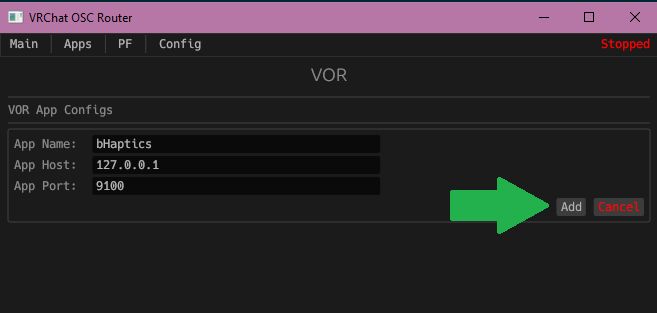
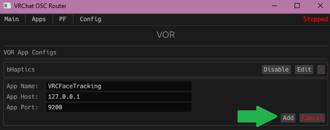
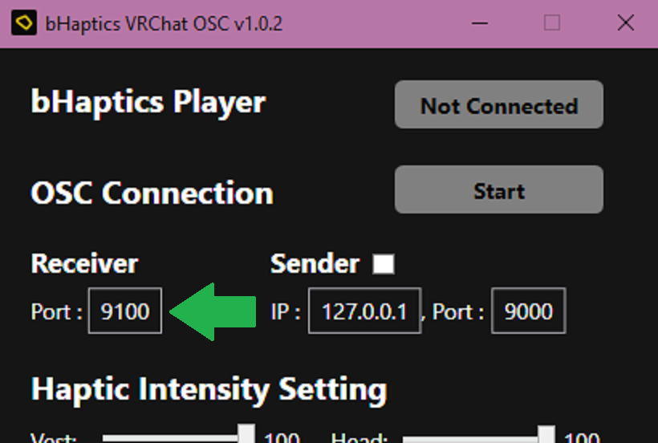
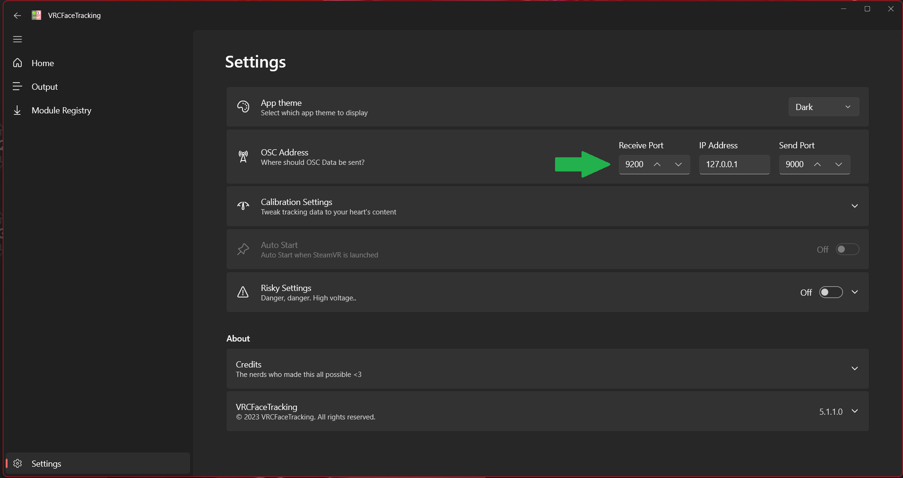

# Example setup with VOR

The general idea of VOR is to send OSC data to multiple applications because VRChat cannot be configured to send to multiple ports.
An example setup using VOR with two other OSC applications that receive data from VRChat.

## Example setup

### Important Note Regarding the bHaptics Application

The bHaptics app will suffer in certain circumstances when an avatar is overloading the application with OSC updates.
The current fix is to use the Packet Filter (PF) in VOR to filter out the "spammy" parameters.

### Applications

In this example we will be setting VOR up with two commonly used applications:
- [bHaptics OSC application](https://github.com/bhaptics/VRChatOSC)
- [VRCFaceTracking OSC application](https://github.com/benaclejames/VRCFaceTracking)

### TLDR;

1. Add two apps in VOR with different app ports. (9100 & 9200)

2. In each app you are using, change their bind/listen/receive port to the respective app ports you set in the VOR application.

3. You are done `:)`

### Add your apps in VOR

1. Create an app for the bHaptics and VRCFaceTracking application.

#### bHaptics VOR

#### VRCFaceTracking VOR

2. Set the bind/listen/receive port in each OSC application.

#### bHaptics Bind Port

#### VRCFaceTracking Bind Port

3. Make sure all your configuration changes are saved in all apps.

4. Start your apps and VOR.